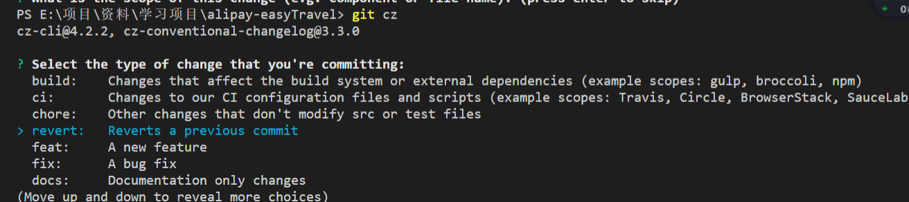
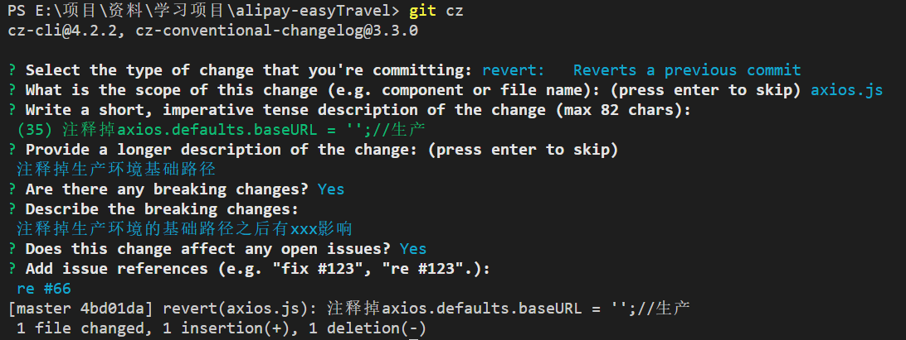
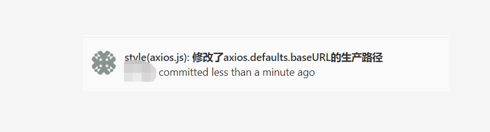
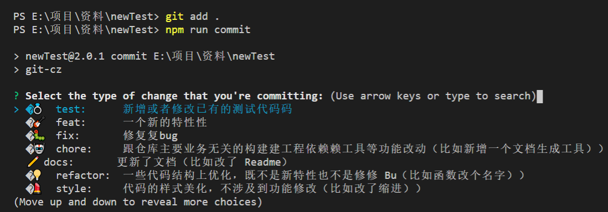
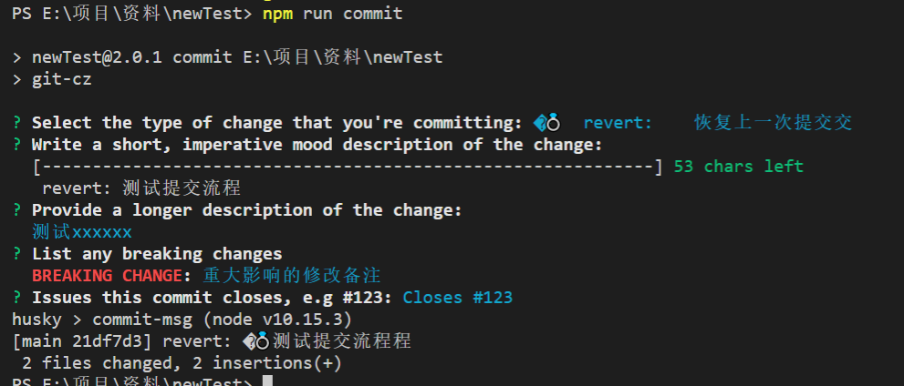

# cz-demo

## git commit 规范

### commit message 作用

-   根据 commit message 自动生成 CHANGELOG.md
-   基于提交的类型，自动决定语义化的版本变更。
-   向同事、公众与其他利益关系者传达变化的性质。
-   触发构建和部署流程。

### commit message 格式

```
<type>(<scope>): <subject>
// 空一行

<body>
// 空一行
<footer>

```

大致分为三个部分(使用空行分割):
标题行:描述主要修改类型和范围以及描述.
body: commit 具体修改内容, 描述为什么修改, 做了什么样的修改, 以及开发的思路等等,可以分为多行.
footer: 一些备注或修复的 bug 的链接.
其中 标题行 是必填，body 和 footer 是选填。

#### 标题行 包括三个字段：type（必填）、scope（选填）和 subject（必填）

scope: commit 影响的范围, 比如: route, component, utils, build...
subject: commit 的概述
以动词开头，使用第一人称现在时，比如 change，而不是 changed 或 changes
第一个字母小写
结尾不加句号（.）

type 用于说明 commit 的类别
type 为 feat 和 fix，则该 commit 将肯定出现在 Change log 之中。

```
feat：新功能（Features）
fix: 修改 bug（Bug Fixes）
perf: 更改代码，以提高性能(Performance Improvements)
refactor: 代码重构（重构，在不影响代码内部行为、功能下的代码修改）(Code Refactoring)
docs: 文档修改(Documentation)
style: 代码格式修改, 注意不是 css 修改（空白、格式化、缺少分号等）(Styles)
test: 测试用例新增、修改（Tests）
build: 影响项目构建或依赖项修改(示例范围：gulp、npm)
revert: 恢复上一次提交
ci: 持续集成相关文件修改(示例范围：Travis、Circle、BrowserStack、SauceLabs)（Continuous Integration）
chore: 构建过程或辅助工具的变动（chore）
release: 发布新版本
workflow: 工作流相关文件修改
```

#### Body

Body 部分是对本次 commit 的详细描述，可以分成多行。
有两个注意点。

（1）使用第一人称现在时，比如使用 change 而不是 changed 或 changes。

（2）应该说明代码变动的动机，以及与以前行为的对比。

#### Footer

Footer 部分只用于两种情况。

1）不兼容变动
如果当前代码与上一个版本不兼容，则 Footer 部分以 BREAKING CHANGE 开头，后面是对变动的描述、以及变动理由和迁移方法。

2）关闭 Issue
如果当前 commit 针对某个 issue，那么可以在 Footer 部分关闭这个 issue 。

```
Closes #234
也可以一次关闭多个 issue 。
Closes #123, #245, #992
```

Revert
还有一种特殊情况，如果当前 commit 用于撤销以前的 commit，则必须以 revert: 开头，后面跟着被撤销 Commit 的 Header。

```
revert: feat(pencil): add 'graphiteWidth' option
This reverts commit 667ecc1654a317a13331b17617d973392f415f02.
```

此时 Body 部分的格式是固定的，必须写成 This reverts commit &lt;hash>. ，其中的 hash 是被撤销 commit 的 SHA 标识符。
如果当前 commit 与被撤销的 commit，在同一个发布（release）里面，那么它们都不会出现在 Change log 里面。如果两者在不同的发布，那么当前 commit，会出现在 Change log 的 Reverts 小标题下面。

提示：Commitizen 替代你的 git commit (使用工具生成符合规范的 commit message)
那么就需要通过 commitizen/cz-cli 工具，我们需要借助它提供的 git cz 命令替代我们之前的 git commit 命令, 帮助我们生成符合规范的 commit message .

> 使用终端工具 (git-cz+ commitizen + cz-conventional-changelog)(Commitizen: 替代 git commit) + (@commitlint/config-conventional @commitlint/cli)(commit lint 校验规则 ) +husky( commit message 时触发检验规则
> )+ conventional-changelog/standard-version(自动生成 CHANGELOG) 一步解决提交信息和版本发布。

### 工具集示例，包含以下工具类型：

-   适配器：用于配置 cz 的提交说明
-   校验：校验提交说明是否符合规范
-   日志：根据提交说明的类型快速生成日志

### 自动生成合格的 commit message

1、全局安装

```bash
    npm install -g git-cz

```

2、 局部安装

`安装 git-cz 和 commitize、 cz-conventional-changelog`

```bash
npm install  git-cz --save-dev
 # 安装commitizen 用于初始化commit的规范
 npm install  -D commitizen
# 使用cz-conventional-changelog 规范(默认定义好了一系列规则)
#初始化项目以使用cz-conventional-changelog适配器
commitizen init cz-conventional-changelog --save-dev --save-exact
```

> 给命令行小白得一个小贴士：
> 如果使用--save-exact 参数，会在 package.json 文件指定安装模块的确切版本。

> –save：模块名将被添加到 dependencies，可以简化为参数-S。

> –save-dev: 模块名将被添加到 devDependencies，可以简化为参数-D。

执行上面安装完成后 package.json 中会自动添加以下内容

```json
{
    "devDependencies": {
        //...
        "git-cz": "^4.7.1",
        "cz-conventional-changelog": "^3.3.0"
    },
    "config": {
        "commitizen": {
            "path": "./node_modules/cz-conventional-changelog"
        }
    }
}
```

3、 自定义配置，新增 [changelog.config.js](https://github.com/lyxdream/cz-demo/blob/main/changelog.config.js)

> changelog 配置，commit 规则也在这里进行配置
> 参考文档：https://www.npmjs.com/package/git-cz

4、使用 git-cz

```json
"scripts": {
    "commit": "git-cz"
}
```

执行 `npm git-cz` 或者执行`npm run commit`
效果如下
配置changelog.config.js之前的效果：






配置changelog.config.js之后的效果：



### commit message lint 校验

#### 安装 commit lint 工具

```bash
  npm i @commitlint/cli -D

```

#### commit lint 常用配置

```bash
npm i @commitlint/config-conventional -D

```

#### 安装 husky，以在 commit message 时触发检验规则

```bash
npm i husky
```

执行上面安装完成后 package.json 中会自动添加以下内容

```json
"devDependencies":{
"@commitlint/cli": "^11.0.0",
"@commitlint/config-conventional": "^11.0.0"
},
"dependencies": {
"husky": "^4.3.0"
}

```

#### 在项目中新建 commitlint.config.js 文件并设置校验规则：

```js
module.exports = {
    // commit lint 校验规则继承
    extends: ['@commitlint/config-conventional'],
    // 自定义校验规则
    rules: {},
}

/** 
 feat：新功能（Features）
fix: 修改 bug（Bug Fixes）
perf: 更改代码，以提高性能(Performance Improvements)
refactor: 代码重构（重构，在不影响代码内部行为、功能下的代码修改）(Code Refactoring)
docs: 文档修改(Documentation)
style: 代码格式修改, 注意不是 css 修改（空白、格式化、缺少分号等）(Styles)
test: 测试用例新增、修改（Tests）
build: 影响项目构建或依赖项修改(示例范围：gulp、npm)
revert: 恢复上一次提交
ci: 持续集成相关文件修改(示例范围：Travis、Circle、BrowserStack、SauceLabs)（Continuous Integration）
chore: 构建过程或辅助工具的变动（chore）
release: 发布新版本
workflow: 工作流相关文件修改
 */
```

#### 配置 husky

```json
"husky": {
    "hooks": {
        "commit-msg": "commitlint -E HUSKY_GIT_PARAMS"
    }
}
```

<!-- > "pre-commit": "npm run lint"，在 git commit 前执行 npm run lint 检查代码格式。 -->

> "commit-msg": "commitlint -E HUSKY_GIT_PARAMS" 在 git commit 时执行 commitlint -E HUSKY_GIT_PARAMS 验证 commit 消息。如果不符合定义的格式，将会报错。

<!-- > "pre-push": "npm test"，在你执行 git push 将代码推送到远程仓库前，执行 npm test 进行测试。如果测试失败，将不会执行这次推送。 -->

配置完成后，每次 commit 就会进行校验，校验不通过会拦截 commit

运行结果如下:



> 会发现出现了husky校验

### 生成 CHANGELOG.md

1、使用 standard-version 来生成 CHANGELOG.md
安装使用:

```bash
npm i -S standard-version
```

执行上面安装完成后 package.json 中会自动添加以下内容

```json
"dependencies":{
"standard-version": "^9.0.0",
}
```

package.json 配置:

```json
"scirpt": {
   ...,
"release": "standard-version"
}
```

执行 npm run release 就会生成 CHANGELOG.md

上面命令不会覆盖以前的 Change log，只会在 CHANGELOG.md 的头部加上自从上次发布以来的变动。

> type 为 feat 和 fix，则该 commit 将肯定出现在 Change log 之中。
> standard-version 有很多功能，点击查看官方文档: [standard-version](https://www.npmjs.com/package/standard-version)

2、用 conventional-changelog 生成 Change log

> conventional-changelog 是一款可以根据项目的 commit 和 metadata 信息自动生成 changelogs 和 release notes 的系列工具，并且在辅助 standard-version 工具的情况下，可以自动帮你完成生成 version、打 tag, 生成 CHANGELOG 等系列过程。

##### conventional-changelog 生态主要模块

-   conventional-changelog-cli - conventional-changelog 核心命令行工具
-   standard-changelog - 针对 angular commit 格式的命令行工具
-   conventional-github-releaser - 利用 git metadata 针对 Github 的发布工具
-   conventional-commits-detector - commit message 规范引用检测
-   commitizen - 针对开发者简单的 commit 规范
-   commitlint - commit Lint 工具

#### 安装

```bash
npm install -g conventional-changelog-cli
```

#### 基本使用

> conventional-changelog -p angular -i CHANGELOG.md -s
> 上面命令不会覆盖以前的 Change log，只会在 CHANGELOG.md 的头部加上自从上次发布以来的变动。

> 如果想生成所有发布的 Change log，要改为运行下面的命令。

`conventional-changelog -p angular -i CHANGELOG.md -s -r 0`

为了方便使用，可以将其写入 package.json 的 scripts 字段。

```json
{
    "scripts": {
        "changelog": "conventional-changelog -p angular -i CHANGELOG.md -s -r 0"
    }
}
```

注意：

> -   type 为 feat 和 fix，perf，revert，则该 commit 将肯定出现在 Change log 之中。
> -   type 为 chore,ci,docs,refactor,style,test 加了 BREAKING CHANGES 会进去，不加不进去。
> -   release 不会出现在选择列表里目前没找到原因

> 区别：conventional-changelog 我目前没找到变更版本号的地方，standard-version 可以更新版本号的变化。
> 如果想测试，演示项目地址：[cz-demo](https://github.com/lyxdream/cz-demo.git)

生成的日志可查看示例：[CHANGELOG](https://github.com/lyxdream/cz-demo/blob/main/CHANGELOG.md)

最后：

参考文章

[阮一峰 Commit message 和 Change log 编写指南](http://www.ruanyifeng.com/blog/2016/01/commit_message_change_log.html)

[如何规范 commit 提交](https://my.oschina.net/u/4291707/blog/3315002)

[commit 规范及自动生成 changelog](https://www.yuque.com/hutao/eusgif/ueqoaf)

[git commit 规范及自动检查工具安装小记](https://juejin.im/post/6844904033635794958)


